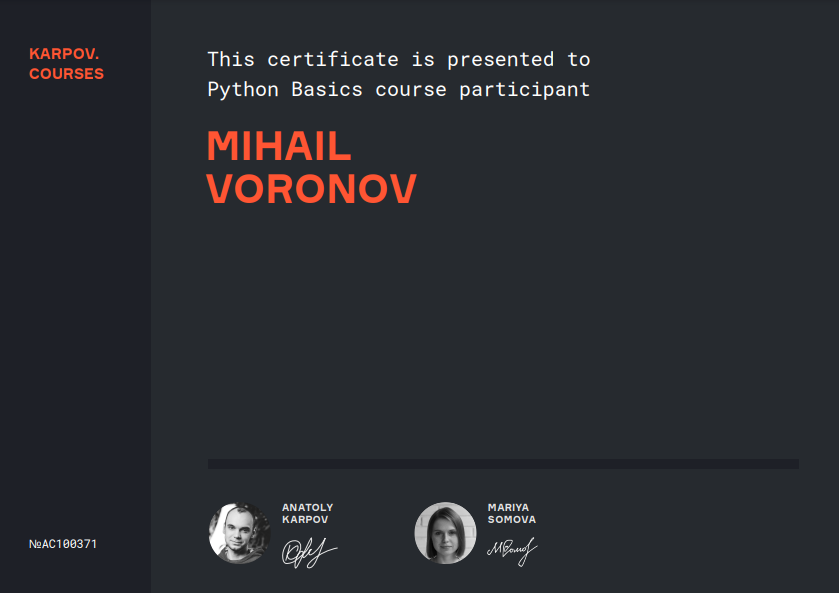
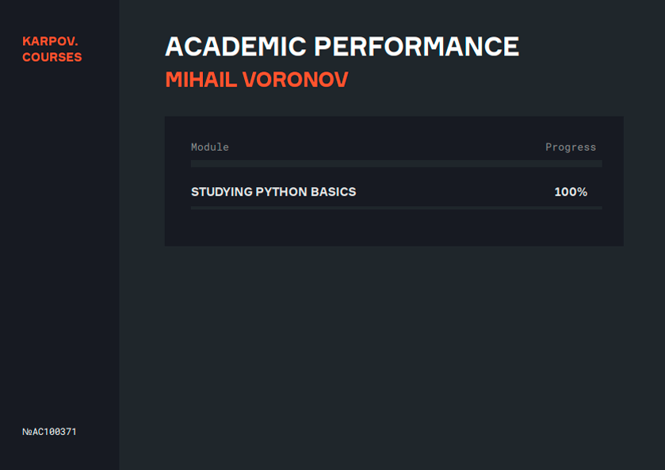

<h1 align="left">Hi 👋 My name is Michael</h1>

###

<h2 align="center">Developer</h2>

###

<h3 align="center">I want to become a Developer. I want to move forward in this field and then do cool and interesting projects.I am finishing the MAI. I know physics and mathematics. Sociable, friendly and kind. My dream is to work in IT</h3>

###

🧠  I'm learning Python, SQL, JAVA and more frameworks 🤝  I'm open to collaborating on different projects, who interest me ✉️  You can contact me at bigtoyka@yandex.ru

###

<h2 align="left">I code with</h2>

###

  
  
  
  
  
  
  
  
  
  
  
  
  
  
  
  

###

<h2 align="left">I have certificates</h2>

###

